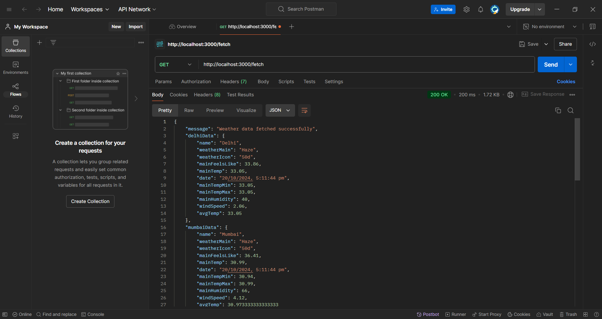
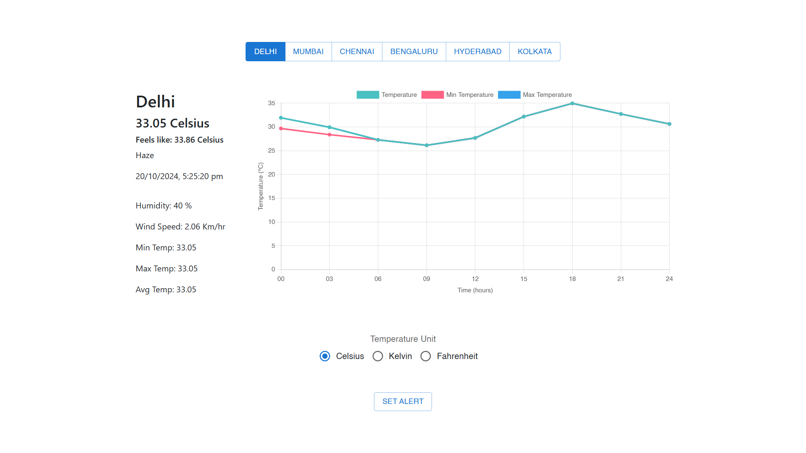
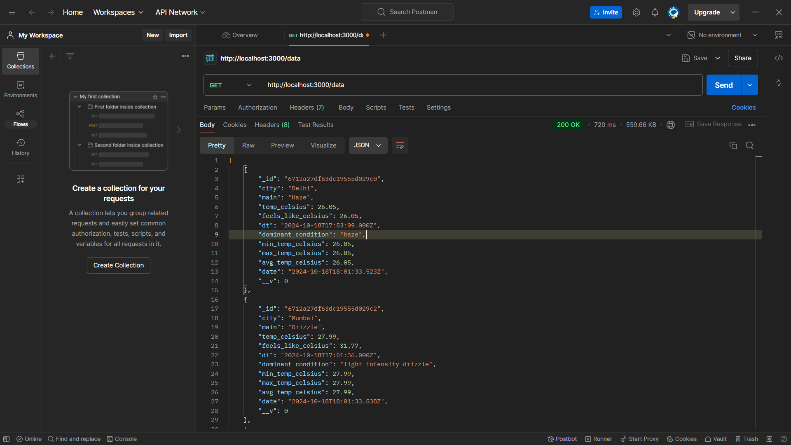
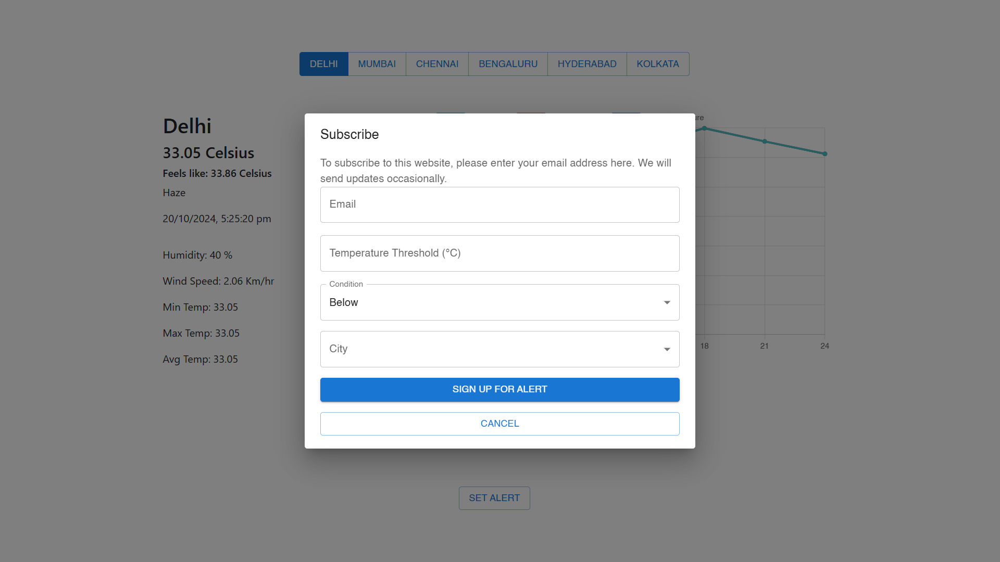

# Real Time Data Processing System for Weather Monitoring

## Overview

Develop a real-time data processing system to monitor weather conditions and provide
summarized insights using rollups and aggregates. The system will utilize data from the
OpenWeatherMap API (https://openweathermap.org/).

## Features

- **Main, temp, feels_like, date:** Weather attributes like temp, main, feels_like, date, speed.
- **Auto update:** Fetches weather data and forecast data every 5 min.
- **Rollups and Aggregate:** Weather data such as avg temp, minimum temp and max temp are calculated and the summary is stored in the database.
- **Alerts:** User sets a threshold, city, condition and their email to receive an alert email.
- **Visualiztions:** A forecast graph has been produced in the homepage for an overview.

## Technology Stack and Features

- ⚡ [**NodeJS**](https://nodejs.org) for the JavaScript backend API.
  - 💾 [MongoDB](mongodb.com/) as the NoSQL database.
- 🚀 [React](https://vite.dev) for the frontend.
  - 💻 Using TypeScript, hooks, Vite, and other parts of a modern frontend stack.
  - 🎨 [Material UI](https://mui.com/material-ui/) for the frontend components.
- ☁️[OpenWeather API](openweathermap.org/) for the accessing the weather data using openweather api.
- 📤[SendGrid](https://app.sendgrid.com) for sending email alerts to the user.

## Setup

1.**Clone the Repository**

```powershell
git clone https://github.com/TinkerWizard/Real-Time-Data-Processing-System-for-Weather-Monitoring.git
cd Real-Time-Data-Processing-System-for-Weather-Monitoring
```

2.**Install Dependencies**

```powershell
cd backend
npm install
```

```powershell
cd frontend
npm install
```

3.**Configure the Database**

Create and Update the `.env` file with your database credentials:

```
OPEN_WEATHER_API_KEY=open_api_key
MONGO_URI=mongo_database
SENDGRID_MAIL_API_KEY=sendgrid_api_key
```

4.**Run the Application(Frontend and Backend)**

```powershell
npm run dev
```

## API Endpoints

#### Fetch Current Weather Data

- **URL:** `/save`
- **Method:** `GET`
- **Description:** This endpoint gets the current date's weather data and populates the data according to the city selected.
  

- **Response :**
  ```json
  {
    "message": "Weather data fetched successfully",
    "delhiData": {
      "name": "Delhi",
      "weatherMain": "Haze",
      "weatherIcon": "50d",
      "mainFeelsLike": 33.86,
      "mainTemp": 33.05,
      "date": "20/10/2024, 5:11:44 pm",
      "mainTempMin": 33.05,
      "mainTempMax": 33.05,
      "mainHumidity": 40,
      "windSpeed": 2.06,
      "avgTemp": 33.05
    }
  }
  ```

#### Fetch Forecast

- **URL:** `/fetch-forecast`
- **Method:** `GET`
- **Description:** This endpoint gets the forecast weather which is then used in making the graph.
  

- **Response(AST):**
  ```json
  {
    "delhiTemp": {
      "city": "Delhi",
      "temp": [33.05, 31.93, 29.94, 27.28, 28],
      "min": [32.86, 29.68, 28.38, 27.28, 26.15],
      "max": [27.74, 26.68, 27.79, 32.32, 34.81]
    }
  }
  ```

### Get Weather Summary From DB**

- **URL:** `/data`
- **Method:** `GET`
- - **Description:** This endpoint allows users to view the stored weather report summary.
    


- **Response(boolean):**
  ```json
  {
        "_id": "6712a27df63dc19555d029c0",
        "city": "Delhi",
        "main": "Haze",
        "temp_celsius": 26.05,
        "feels_like_celsius": 26.05,
        "dt": "2024-10-18T17:53:09.000Z",
        "dominant_condition": "haze",
        "min_temp_celsius": 26.05,
        "max_temp_celsius": 26.05,
        "avg_temp_celsius": 26.05,
        "date": "2024-10-18T18:01:33.523Z",
        "__v": 0
    },
  ```

### Create Alert

- **URL:** `/create-alert`
- **Method:** `POST`
- - **Description:** This endpoint allows users set alerts.
    

- **Body:**
  ```json
  {
    "email": "email",
    "threshold": "temperature",
    "condition": "above or below",
    "city": "city"
  }
  ```
